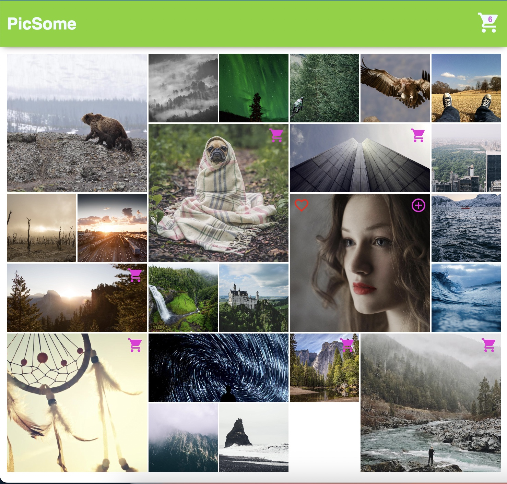
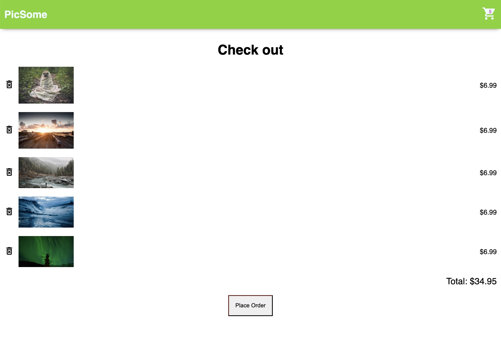
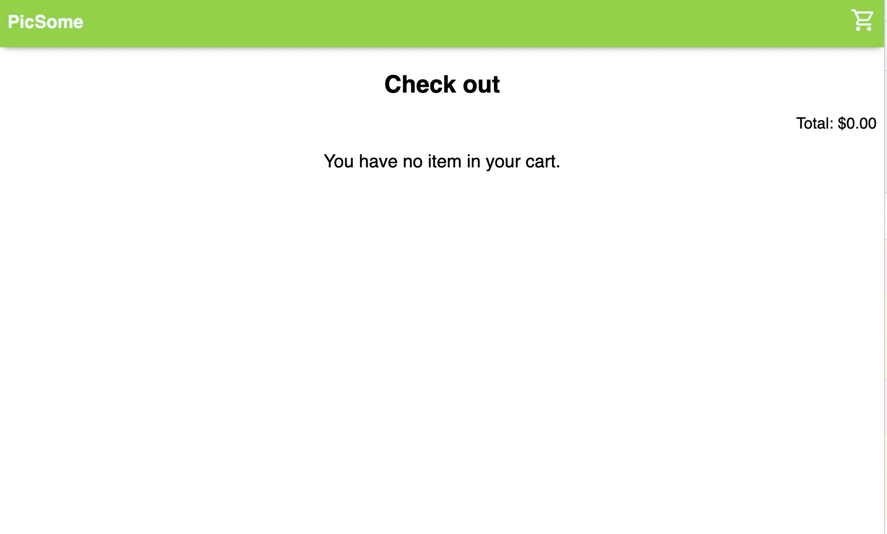

# PicSome Webshop

:::

:::

:::

PicSome Webshop is a React e-commerce application that allows users to browse and purchase products. With this app, users can easily add products to their cart, checkout, and manage their orders.

## Features

Browse products by category or search for specific products
Add products to cart and manage cart items
Checkout and place orders

## Tools and Technologies

React.js
useState and useEffect hooks for state management
PropTypes for type checking
useContext for global state management
React Router for client-side routing
Material UI for UI components and styling
